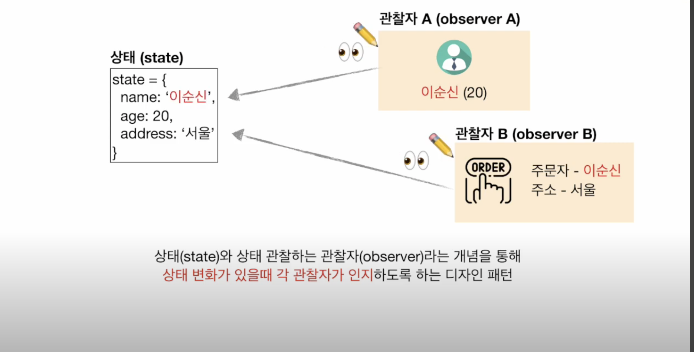
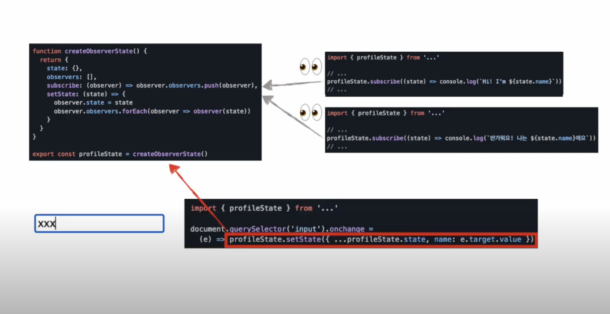
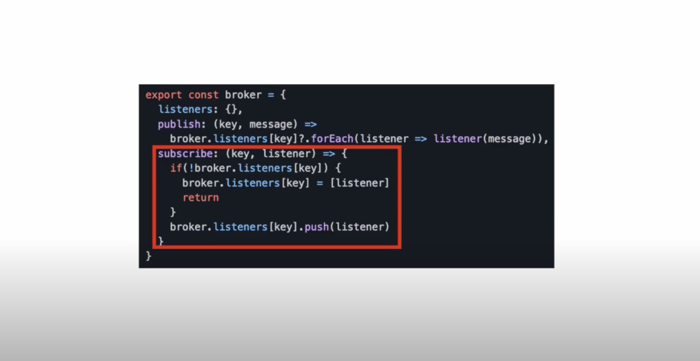
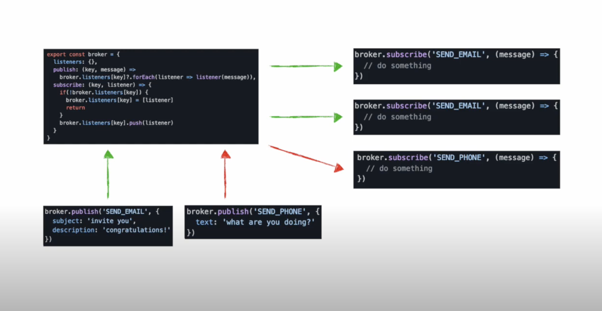
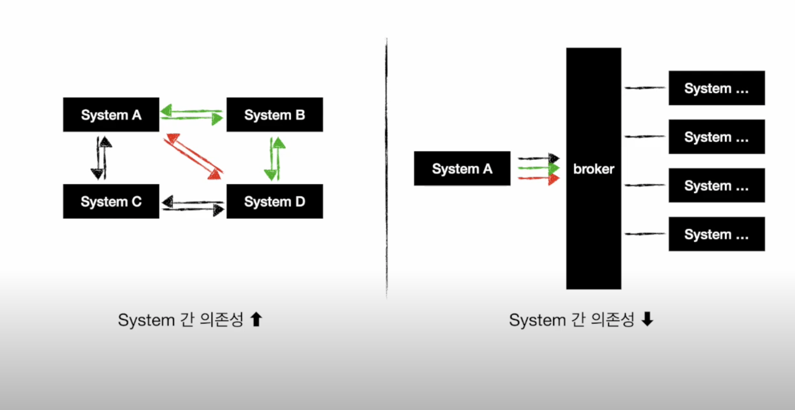
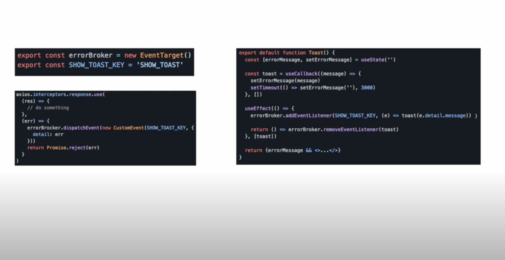
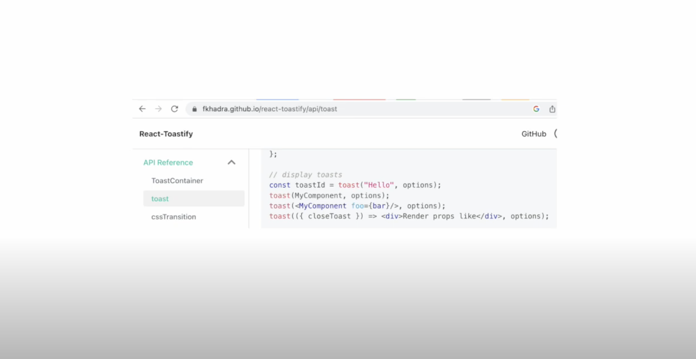

## Observer Pattern

- 상태(State)와 상태 관찰하는 관찰자(Observer)라는 개념을 통해

- **상태 변화가 있을 때 각 관찰자가 인지**하도록 하는 디자인 패턴으로 아래 그림과 같이 나타낼 수 있다

- 이러한 옵저버 패턴을 사용하면 이벤트가 일어났을 때 관찰자들이 알아차릴 수 있게 된다

- 옵저버 패턴을 사용하지 않는다면 매초, 매분, 매 시간마다 요청을 보내서(polling, 주기적으로 감지) 이벤트가 일어났는지 확인해야 한다

  - 예시로, 알람이 울렸을 때 같은 방에 있는 모든 사람이 알람을 듣고 반응하는 것과 같다

- 즉, 이벤트 기반의 기능을 구현할때 원하는 기능이 동적으로 동작이 수행되도록 해주는 역활을 한다

  - 예를들어 알림, 메세지, UI 이벤트 등록 등

  - 객체 (또는 컴포넌트) 의 상태 변화에 따라서 반응처리를 해줘야 할때 사용되기도 한다



- 아래와 같은 코드로 작성할 수 있다



- 왼쪽에 있는 createObserverState의 함수 내에 있는 각 코드는 아래와 같다

- state

  - 상태를 담는 곳

- listeners

  - 상태 변화를 통지 받을 리스너 함수들을 보관하는 곳

- subscribe

  - listeners에 함수를 등록할 수 있는 함수

- setState

  - 상태를 변화시키는 함수

  - 함수 코드를 보면 등록된 listeners들에게 새로운 상태를 전파하는 모습을 볼 수 있다

- 그리고 오른쪽에 있는 것 처럼 subscribe 함수를 통해 각각의 모듈에서 상태 변화를 감지할 수 있다.

- 가장 아래 있는 코드에서 볼 수 있는 것 처럼, setState를 통해서 상태 변화가 일어나면

- listeners에 등록된 각 listener를 통해 관측자들에게 상태가 변화했음을 알리는 것이다

- 즉, subscribe를 통해서 listners에 함수를 등록해 놓았기 때문에

- setState가 호출되면 `observer.observers.forEach(observer => observer(state))`를 통해서 등록한 함수가 실행되는 것

<br/>

- 또 다른 예시로 다음과 같은 코드가 있다

- 관찰 대상의 "주제 객체" (옵저버 대상)

- 관찰을 하는 "구독 객체" (옵저버)

- 구독객체는 자유롭게 주제겍체를 등록/등록 취소할 수 있고

- 한 주제 객체의 상태가 바뀌면 다른 구독 객체들에게 상태와 변경을 알림

```js
// 옵저버 대상
class Subject {
  constructor() {
    this.observers = [];
  }

  getObserverList() {
    return this.observers;
  }

  // 옵저버 등록
  subscribe(observer) {
    this.observers.push(observer);
  }

  unsubscribe(observer) {
    this.observers = this.observers.filter((obs) => obs !== observer);
  }

  notifyAll() {
    this.observers.forEach((subscriber) => {
      try {
        subscriber.update(this.constructor.name);
      } catch (err) {
        console.error('error', error);
      }
    });
  }
}

// 옵저버
class Observer {
  constructor(name) {
    this.name = name;
  }
  update(subj) {
    console.log(`${this.name}: notified from ${subj} class!`);
  }
}

const subj = new Subject();

// 옵저버 인스턴스 생성
const a = new Observer('A');
const b = new Observer('B');
const c = new Observer('C');

// 구독 시작
subj.subscribe(a);
subj.subscribe(b);
subj.subscribe(c);

console.log(sub.getObserverList());
// 세가지 인스턴스가 출력된다

sub.notifyAll();
// `A: notified from Subject class!`
// `B: notified from Subject class!`
// `C: notified from Subject class!`

// 해지
subj.unsubscribe(b);

// 해지된 것 빼고 출력된다
sub.notifyAll();
// `A: notified from Subject class!`
// `C: notified from Subject class!`
```

### Pub/Sub 모델

- 옵저버 패턴을 이야기할 때 빠지지 않고 등장하는 것으로 발행/구독 (**Pub**lish/**Sub**Scribe) 모델이 있다

- 하나의 상태를 감지하는 디자인을 넘어서 broker라고도 불리는 중개자라는 개념을 통해

- 불특정 다수의 관찰자들에게 그들이 구독하는 관심사에 대한 메세지를 전달하는 디자인이다

  - 유튜브의 구독과 같은 개념

- 아래 코드를 통해서 보면 다음과 같다



- broker는 특정 key로 구분되는 listener 집합에게 메세지를 발행하는 publish 함수와

- 특정 key로 발행되는 메세지를 구독할 리스너를 등록하는 subscribe로 구성할 수 있다.

- 이제 관측자는 아래처럼 브로커에 리스너를 등록해둠으로써 누군가 특정 메세지를 발행했을때, 그 메세지를 수신할 수 있다.



- 이러한 역할을 수행하는 공식 api로는 브라우저의 [message channel](https://developer.mozilla.org/en-US/docs/Web/API/MessageChannel), [event target](https://developer.mozilla.org/en-US/docs/Web/API/EventTarget/EventTarget)등이 있다.

- 발행/구독 디자인을 사용하면 발행자와 구독자 간 관계를 브로커가 대행하고,

- 이들은 서로의 존재를 모른채 인터페이스 혹은 메세지에만 의존하기 때문에 스템 간 상호 의존성을 줄여줄 수 있다.



- 프론트엔드 세계에서 벌어지는 다양한 의존성 문제들에도 적용해볼 수 있다.

- 예를들어 react를 사용하는 프로젝트에서 axios 요청에 대한 에러 응답이 도착했을때 toast를 띄우고싶은 경우라면

- 각 요청마다 catch를 하는건 비효율적일것같고 막연하게는 axios interceptor에 무슨짓을 해야될 것 같은데

- react 컴포넌트에 에러를 어떻게 전달할지 감이 잘 오지 않는다.

- 여기에 발행/구독 디자인을 사용 해볼 수 있다.



- 가장 왼쪽에서 볼 수 있듯이 errorBroker처럼 간단하게 에러 관련 메세지들을 중개할 broker를 만들고

- Toast 함수를 정의해서 toast 노출을 담당하는 react 컴포넌트에서 구독을 걸어두면

- axios interceptor에서 broker에게 에러 메세지를 publish하는 것으로 react 컴포넌트에게 일을 시킬 수 있게된다.

- 이는 아래처럼 react toastify라는 라이브러리가 별도의 컴포넌트 설정을 하지않아도 react lifecycle을 갖는 toast 컴포넌트를 노출할 수 있는것과 비슷한 원리



- 물론 이런 구현은 간단한 수준의 옵저버 패턴만으로도 가능하겠지만 다양한 에러를 특정 형태로 처리할 계획이 있다면 발행/구독 모델도 좋은 선택이 될 수 있을 것

---

## Reference

- [프론트엔드에 디자인패턴 끼얹기2 - 관찰자 패턴, 발행 구독(observer pattern, pub sub)](https://www.youtube.com/watch?v=aH4U6bfi_Ds&t=20)
- [디자인패턴, Observer Pattern, 옵저버 패턴](https://www.youtube.com/watch?v=1dwx3REUo34&t=30)
- [개발자가 알아야할 디자인패턴 | ep3. Observer Pattern | 자바스크립트 옵저버 패턴](https://www.youtube.com/watch?v=1UxRkggQwbs&t=29)
- [Observer 패턴](https://patterns-dev-kr.github.io/design-patterns/observer-pattern/)
- [Observer 패턴 알아보기 (hooks와 observables)](https://www.howdy-mj.me/javascript/observer-pattern)
